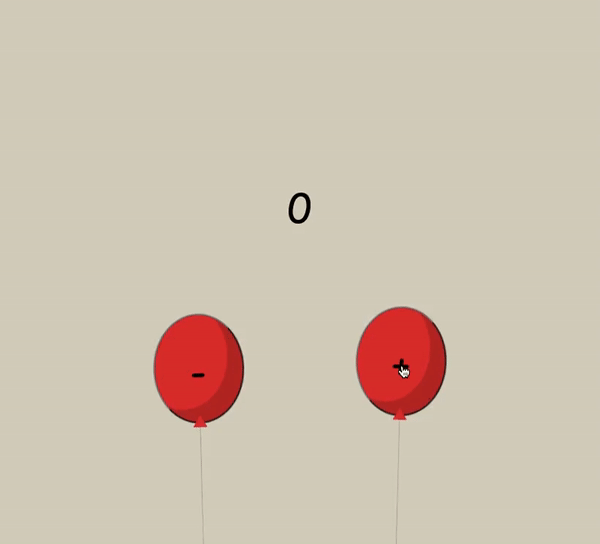

## Contador simplificado em React

<i>Projeto desenvolvido como desafio referente ao módulo 2 do curso Vai na Web de desenvolvimento front-end. </i>  

Nesse projeto, para fixação dos conhecimentos adquiridos em React.js, foi desenvolvida uma pequena e simples aplicação com função de contagem. 

Para tanto, foi utilizado um `react class component` com `state` e atualização através do método `setState`.

## PREVIEW

  

